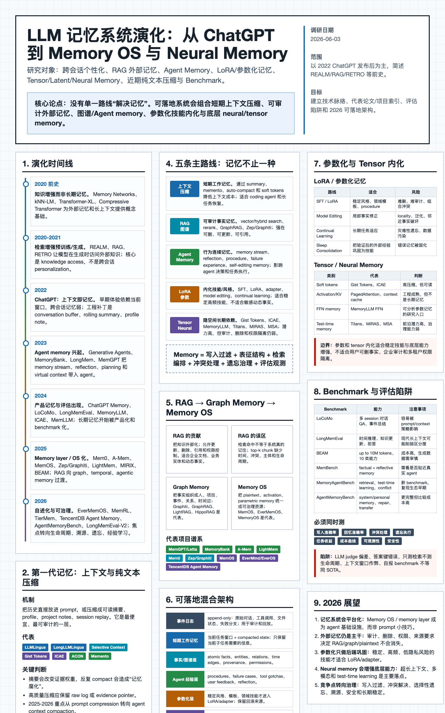

# ideas-with-codex

Independent ideas developed with Codex, packaged as final presentation artifacts.

## Quick Index

| Idea | Type | Main Artifact | Visual Index | Supporting Files |
| --- | --- | --- | --- | --- |
| [LLM Memory Systems](#llm-memory-systems) | Research deck + academic poster | [PPTX](llm-memory-systems/deck.pptx) | [Deck preview](llm-memory-systems/deck-preview.png), [poster preview](llm-memory-systems/poster-preview.png) | [Research notes](llm-memory-systems/research-notes.md), [poster PDF](llm-memory-systems/poster.pdf), [A0 poster](llm-memory-systems/poster-a0.pdf) |
| [LLM Memory Imagegen Academic Deck](#llm-memory-imagegen-academic-deck) | Image-heavy academic deck | [PPTX](llm-memory-imagegen-academic/deck.pptx) | [Contact sheet](llm-memory-imagegen-academic/contact-sheet.png), [deck preview](llm-memory-imagegen-academic/deck-preview.png) | Generated slide overview |
| [NexusKin X01](#nexuskin-x01) | Concept product launch deck | [PPTX](nexuskin-x01/deck.pptx) | [Contact sheet](nexuskin-x01/contact-sheet.png) | [Source notes](nexuskin-x01/source-notes.md) |

## Visual Index

### LLM Memory Systems

A research-oriented deck and academic poster about the evolution of memory systems for LLMs, covering context windows, RAG, long-term memory, agent memory, LoRA-style adaptation, and emerging memory architectures.

| Deck Preview | Poster Preview |
| --- | --- |
| [](llm-memory-systems/deck-preview.png) | [](llm-memory-systems/poster-preview.png) |

Artifacts:

- [Download PowerPoint deck](llm-memory-systems/deck.pptx)
- [Open academic poster PDF](llm-memory-systems/poster.pdf)
- [Open A0 poster PDF](llm-memory-systems/poster-a0.pdf)
- [Read research notes](llm-memory-systems/research-notes.md)
- [Open poster HTML](llm-memory-systems/poster.html)

### LLM Memory Imagegen Academic Deck

An image-heavy academic presentation exploring the same LLM memory theme through generated visual slides.

[](llm-memory-imagegen-academic/contact-sheet.png)

Artifacts:

- [Download PowerPoint deck](llm-memory-imagegen-academic/deck.pptx)
- [Open contact sheet](llm-memory-imagegen-academic/contact-sheet.png)
- [Open deck preview](llm-memory-imagegen-academic/deck-preview.png)

### NexusKin X01

A product-launch style deck for a concept wearable device, built as an image-driven presentation.

[](nexuskin-x01/contact-sheet.png)

Artifacts:

- [Download PowerPoint deck](nexuskin-x01/deck.pptx)
- [Open contact sheet](nexuskin-x01/contact-sheet.png)
- [Read source notes](nexuskin-x01/source-notes.md)

## Repository Structure

```text
llm-memory-systems/
llm-memory-imagegen-academic/
nexuskin-x01/
```

Each top-level folder is intended to stand alone as one idea, with the final `.pptx` and supporting preview or note files kept together.
